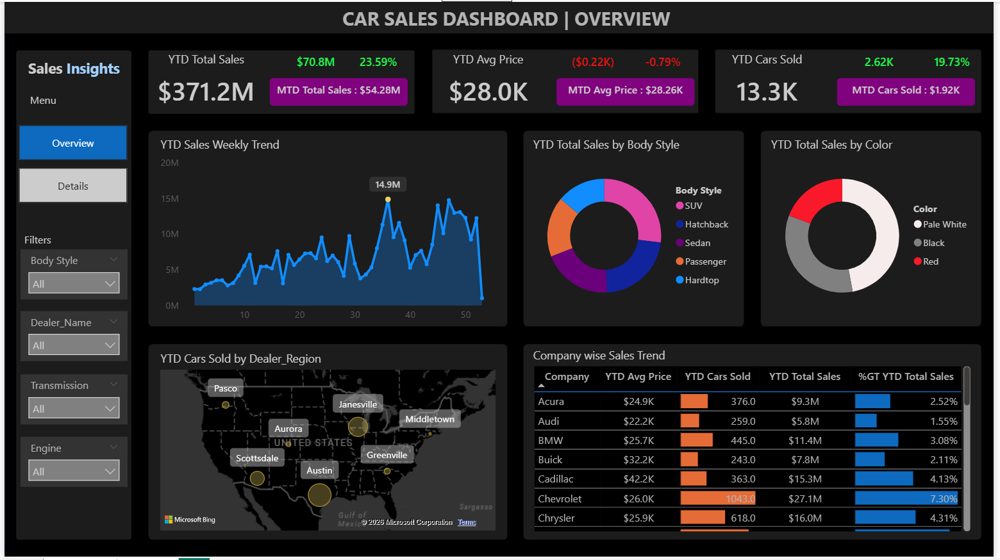
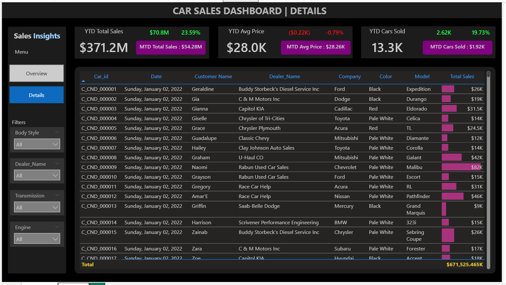

# 🚗 Car Sales Dashboard

---

## 📝 Introduction
This is an individual end-to-end Business Intelligence project developed using Microsoft Power BI Desktop.
The project focuses on analyzing car sales data to generate meaningful business insights for stakeholders, sales managers, and decision-makers.

The dashboard provides a complete overview of sales performance, revenue trends, customer insights, and product analysis in an interactive and user-friendly format.

## 🎯 Project Objective
The primary objective of this project is to:

- Analyze overall car sales performance

- Identify revenue trends and growth patterns

- Evaluate top-performing car models and brands

- Understand customer purchasing behavior

- Help stakeholders make data-driven business decisions

This project is purely focused on delivering actionable insights through effective dashboard design and data visualization.

## 🛠️ Tools & Technologies Used

- Power BI Desktop

- Power Query (Data Cleaning & Transformation)

- DAX (Data Analysis Expressions)

- Data Modeling

- Interactive Dashboard Design

## 📂 Dataset Description

The dataset used in this project contains detailed information about car sales transactions.

## 🔹 Dataset Includes:

- Order Date

- Customer Details

- Car Brand

- Car Model

- Sales Amount

- Quantity Sold

- Region / Location

- Sales Representative

- Payment Mode

## 🔹 Data Structure:

- Structured sales transaction data

- Cleaned and transformed using Power Query

- Relationships built using Data Modeling for better analysis

## 🔄 Project Workflow

1️⃣ Data Import into Power BI

2️⃣ Data Cleaning using Power Query

3️⃣ Data Transformation & Formatting

4️⃣ Data Modeling (Creating Relationships)

5️⃣ Creating DAX Measures (Revenue, Profit, KPIs, etc.)

6️⃣ Dashboard Design & Visualization

7️⃣ Final Insight Generation

## 📊 Dashboard Features

👉  📈 Sales Trend Analysis (Monthly / Yearly)

👉  💰 Total Revenue KPI Cards

👉  🚘 Top Selling Car Brands & Models

👉  🌍 Regional Sales Distribution

👉  👥 Customer Insights

👉  📊 Interactive Filters & Slicers

👉  📌 Dynamic Visualizations

---

## 📷 Dashboard Preview

### 🏠 Overview Page

### Details Page 

## 📈 Business Impact

This dashboard helps:

- Sales Managers track performance

- Business Owners identify profitable products

- Marketing Teams understand customer trends

- Decision-makers take data-driven actions

---

## 📊 Dashboard Analysis

The dashboard provides a comprehensive view of the car sales performance across different dimensions such as sales trends, product performance, regional sales, and customer purchasing patterns. The interactive visuals allow stakeholders to explore the dataset and quickly identify important business metrics.

### 🔹 Sales Performance Overview

The KPI cards at the top of the dashboard highlight the total sales revenue, number of cars sold, and overall sales performance. These metrics provide a quick summary of the business performance and help stakeholders monitor overall growth.

### 🔹 Sales Trend Analysis

The sales trend visualization shows how car sales fluctuate over months and years. 
This helps in identifying:

- Seasonal sales patterns

- High-performing sales periods

- Slow sales months

Understanding these trends helps businesses plan inventory, marketing campaigns, and promotions more effectively.

### 🔹 Top Performing Car Brands & Models

The dashboard highlights the best-selling car brands and models based on sales revenue and quantity sold. 
This helps identify:

- Most popular car models among customers

- High revenue-generating products

- Products with lower demand that may require marketing improvements

### 🔹 Regional Sales Distribution

The regional analysis visual shows how sales are distributed across different locations or regions. 
This helps businesses understand:

- Which regions generate the highest revenue

- Which markets require more focus or expansion

- Regional demand variations for different car models

### 🔹 Customer Purchase Behavior

Customer insights help in understanding purchasing patterns such as:

- Preferred car brands

- Frequency of purchases

- Customer demand trends

These insights can help improve customer targeting and marketing strategies.

---

## 🔍 Key Insights

From the dashboard analysis, several important insights can be derived:

- Certain car models consistently generate the highest revenue, indicating strong customer demand.

- Sales show periodic fluctuations, suggesting seasonal buying behavior.

- Some regions contribute significantly more to overall sales, highlighting key markets for the business.

- A small number of products often contribute to a large portion of total revenue, reflecting a typical sales concentration pattern.

- Customer purchasing patterns indicate clear preferences for specific brands and models, which can guide future inventory planning.

---

## 📌 Conclusion

The Car Sales Dashboard project demonstrates how raw sales data can be transformed into meaningful business insights using Power BI. By leveraging data cleaning, data modeling, and interactive visualizations, the dashboard provides a clear and comprehensive view of overall sales performance.

Through this analysis, stakeholders can easily identify sales trends, top-performing car models, regional performance, and customer purchasing behavior. These insights help businesses make data-driven decisions, improve sales strategies, and optimize product offerings.

Overall, this project highlights the power of Business Intelligence tools like Power BI in converting complex datasets into actionable insights that support strategic planning and business growth.

---

## ❤️ Contributing

Contributions are welcome! Fork the repository, create a new branch, and submit your pull request with improvements or new features.

---

✨ Let’s use data to make informed decisions and create safer communities! ✨

